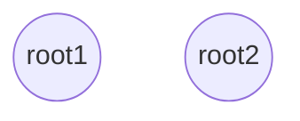
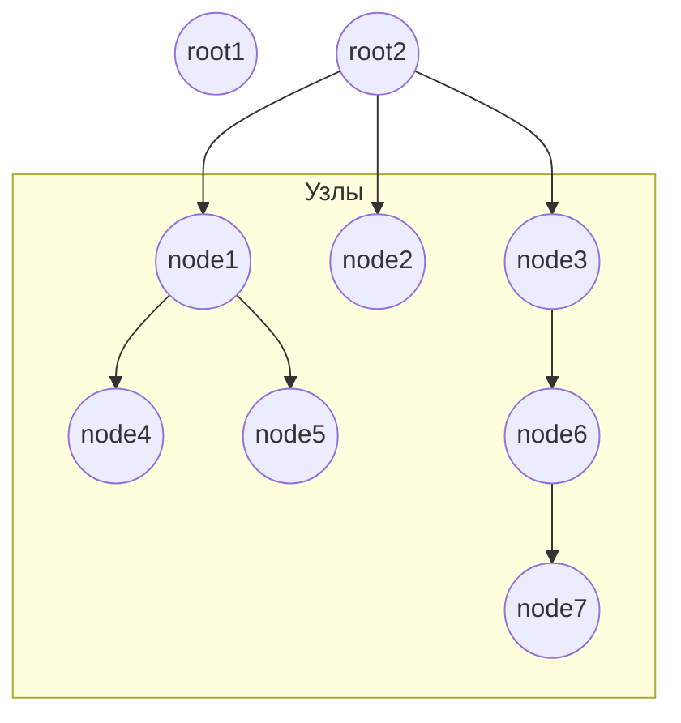
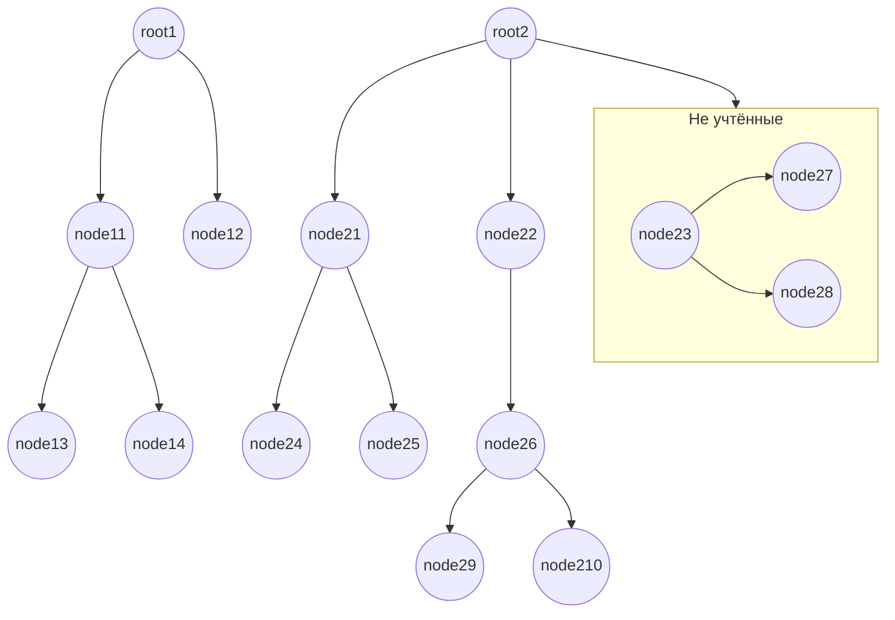

## Как работает структурная метрика.

Структурная метрика является самой весомой в данном проекте и самой непонятной или недоисследованной, поэтому целью данного документа является её описание. Непонятно есть ли у неё какое-то реальное название (существовала ли она до этого), но получена она путём эвристических рассуждений.

Алгоритм начинается с того, что на вход поступают два AST дерева (можно также сравнивать любые другие деревья по структуре), которые будут между собой сравниваться. Далее проверяются, есть ли у каждого из двух корней дети и тут возможны четыре случай:

1. Самый простой, если оба корня не имеют потомков (листы), тогда мы возвращаем [1, 1] (первое число это числитель дроби, а второе знаменатель, т.е. 1/1 = 1 итоговое значение метрики) и говорим, что структуры одинаковые.

2. Если первый корень не имеет потомков (лист), а у второго есть, возвращаем величину, равную 1 / (общее_количество_узлов_во_втором_корне + 1). Один в числителе значит, что у нас совпадает один узел, а именно корневой, его же мы добавляем в знаменатель.

$$\frac{1\ (общий) }{7\ (дочерних) + 1\ (корень)}$$

3. Если второй корень не имеет потомков (лист), а первый имеет, аналогично как в пункте 2 говорим, что схожесть 1 / (общее_количествово_узлов_в_первом_корне + 1).

4. Более сложный случай, который является также более интересным, когда оба корня не являются листами. Для удобства составляется матрица соответствия узлов A, с количеством строк i - количество детей у первого корня и количеством столбцов j - количеством детей у второго корня. При этом i-ая строка отвечает за i-ого ребёнка, а j-ый столбец отвечает за j-го ребёнка. При этом рекурсивно для каждого `a_ij` значения матрицы выполняются все приведённые выше операции для вычисления схожести i-го ребенка первого корня с j-ым второго.

После того, как матрица составлена, вычисляется общая схожесть корней по данной матрице. Для этого изначально инициализируем схожесть, как same_metric = [1, 1], что значит, что у нас схожи только корни. Далее суть алгоритма заключается в том, что мы будем доставать из матрицы столько значений, сколько соответствует количеству потомков у корня с меньшим количеством потомков.

В примере ниже у нас 2 (2 строки) ребенка у первого корня и 3 (3 столбца) у второго, следовательно нам необходимо будет достать 2 значения из матрицы.

|Первый корень \ Второй корень|Первый узел|Второй узел|Третий узел|
|-----------------------------|-----------|-----------|-----------|
|Первый узел                  | 1 / 5     | 3 / 6     | 2 / 3     |
|Второй узел                  | 1 / 8     | 2 / 5     | 1 / 3     |

1. Ищем наибольшее значение (числитель делить на знаменатель) и складываем его числитель с числителем same_metric, а знаменатель со знаменателем same_metric. В примере наибольшее значение 2/3. И same_metric станет [1 + 2, 1 + 3] = [3, 4].
2. Обнуляем значения по строкам и столбцам с выбранным элементом. Матрица примет вид:

|Первый корень \ Второй корень|Первый узел|Второй узел|Третий узел|
|-----------------------------|-----------|-----------|-----------|
|Первый узел                  | 0         | 0         | 0         |
|Второй узел                  | 1 / 8     | 2 / 5     | 1 / 3     |

3. Повторяем алгоритм с первого пункта оставшееся количество раз.

Следующее значение выбирается 2/5, same_metric = [3 + 2, 4 + 5] = [5, 9] и выбор завершается.

Следующий шаг включает в себя учёт не учтённых узлов и возникает, если количество детей в одном из корней не совпадает. Если в первом корне больше детей, то мы смотрим в нём, какие из потомков не были учтены и уже добавляем общее количество узлов данного не учтённого потомка (включая его самого) в знаменатель same_metric.

В примере ниже после составления матрицы и вычисления same_metric, в root2 останется неучтённый 3ий узел (node23). Количество его узлов и его самого добавляем в знаменатель.

$$\frac{5\ (общих) }{7\ (узлов) + 1\ (корень) + 3\ (не\ учтённые)}$$

## Пример уязвимости

Пусть в первом файле есть небольшая функция small_func и большая big_func, а во втором только маленькая small_func. И, к примеру, small_func == small_func, а big_func схожа на 20% со small_func и на выходе будет получено проходящее проверку значение. Для решения данной проблемы стоит рассматривать поиск по источникам, который будет более трудозатратен, но поможет выявлять такие части, это будет актуально для разбитых на модули программ. С другой стороны, когда есть уверенность, что два модуля идентичны по функционалу, то данный алгоритм будет работать.

Как развитие алгоритма можно говорить, на сколько процентов одна работа является подмножеством другой, не беря в расчёт неучтённые узлы.
